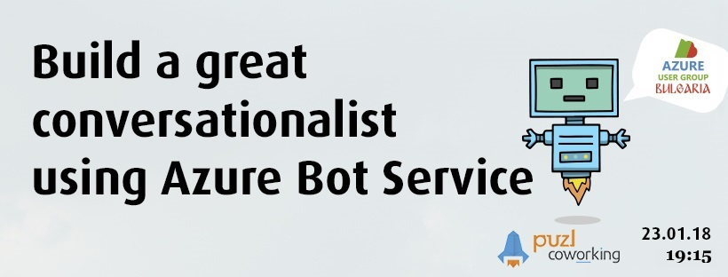
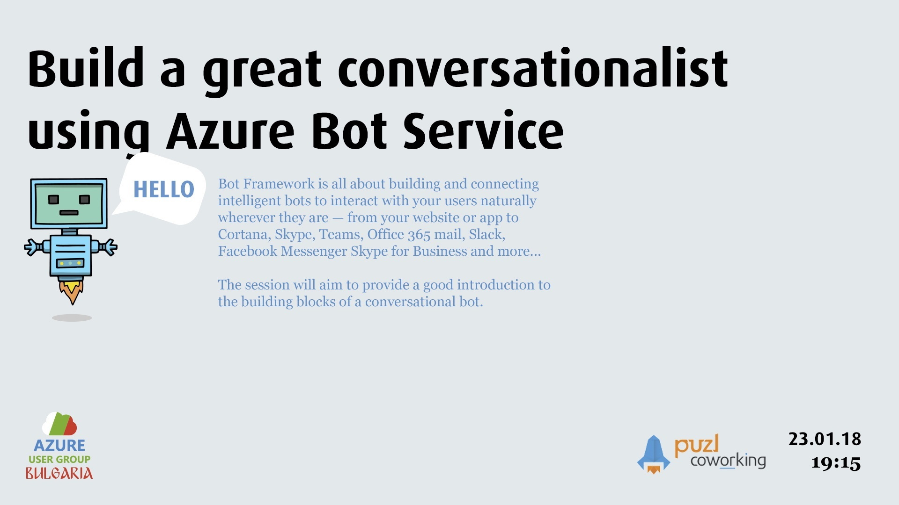
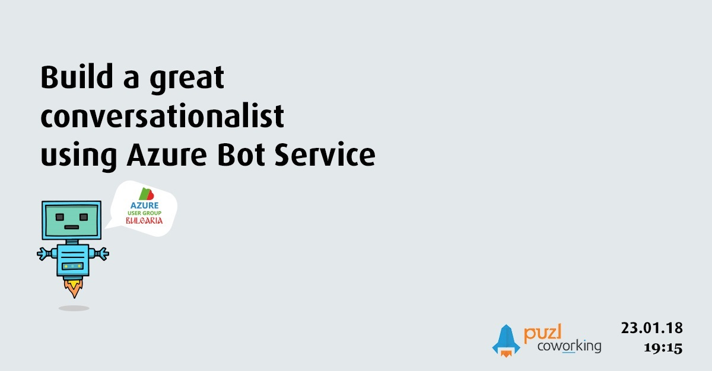

# Build a great conversationalist using Azure Bot Service

Azure Bot Service is a cost-effective, chatbot service that scales on demand. By using it you can focus on building intelligent bots, not how to run and scale them. Bot Framework is all about building and connecting intelligent bots to interact with your users naturally wherever they are — from your website or app to Cortana, Skype, Teams, Office 365 mail, Slack, Facebook Messenger Skype for Business and more... The session will aim to provide a good introduction to the building blocks of a conversational bot.

Speaker: Radoslav Gatev (https://www.linkedin.com/in/radoslavgatev/)

Radoslav Gatev is a software architect and consultant who spends most of his time in the cloud, to be more precise, in Microsoft Azure. He is a conference speaker, blogger, open source contributor and advisor at Azure Research Panel. 

## Resources

Slides - [slides.pdf](slides.pdf)

## Covers

  
  

