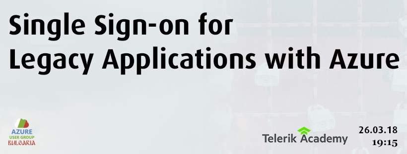
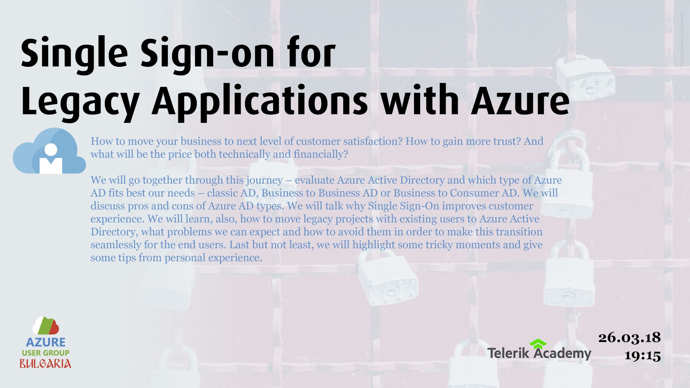
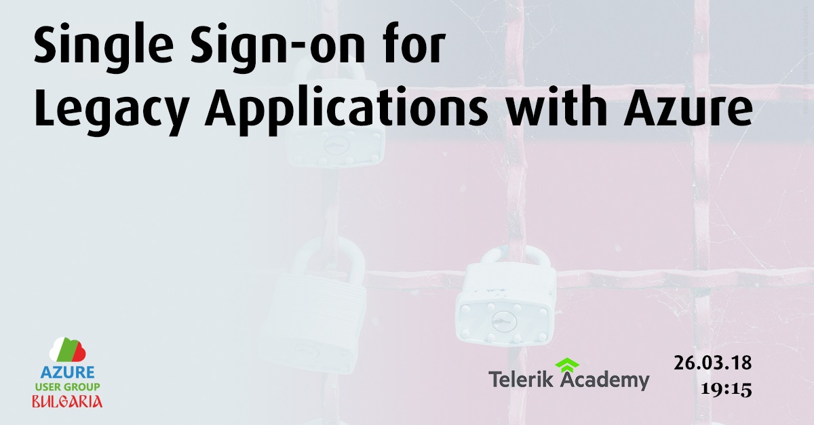

# Single Sign-on for Legacy Applications with Azure

How to move your business to next level of customer satisfaction? How to gain more trust? And what will be the price both technically and financially?

We will go together through this journey – evaluate Azure Active Directory and which type of Azure AD fits best our needs – classic AD, Business to Business AD or Business to Consumer AD. We will discuss pros and cons of Azure AD types. We will talk why Single Sign-On improves customer experience. We will learn, also, how to move legacy projects with existing users to Azure Active Directory, what problems we can expect and how to avoid them in order to make this transition seamlessly for the end users. Last but not least, we will highlight some tricky moments and give some tips from personal experience.

Лектор: Христомир Христов (https://www.linkedin.com/in/hristomir-hristov-13810240/)

Христомир е .НЕТ програмист и софтуерен архитект с повече от 10 години професионален опит. Ръководил е миграции на продукти от on premise в клауд пространството. Проектирал и имплементирал в продуктивни системи различни PaaS и SaaS решения. Оценявал и внедрявал различни клауд решения и технологии в нови или вече съществуващи проекти.

## Resources

Slides - [slides.pdf](slides.pdf)  
Source - contained in source folder

## Covers

  
  

